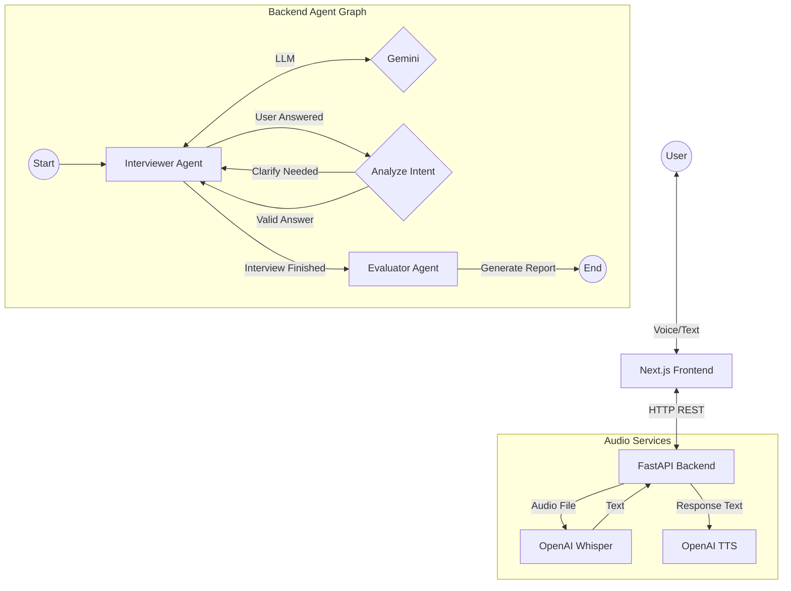

# AI Interview Coach & Simulator


A realistic, voice-enabled technical interview simulator powered by **Multi-Agent Orchestration**.

This application is designed to help candidates practice for job interviews by simulating real-world scenarios. It orchestrates a complex interaction between a **Next.js Frontend** and a **FastAPI Backend**, leveraging **LangGraph** to manage conversation state and **OpenAI/Google Gemini** models for intelligent, context-aware dialogue. It is designed to be modular, scalable, and fully containerized via **Docker**.

---

## Key Technical Features

- **Multi-Modal Interaction:** Supports both Text-based Chat and Voice Push-to-Talk (PTT) modes seamlessly.

- **Context-Awareness:** The system adapts its persona based on:

  + **Job Role:** (e.g., Junior Python Developer)

  + **Industry:** (e.g., Healthcare, E-commerce)

  + **Job Description:** (Optional) Can parse raw JD text to generate specific questions.

- **Adaptive Interview Flow (LangGraph):** The core logic is built on a state machine, not a linear script.

  + **Smart Clarification:** If a candidate says "I don't understand," the agent rephrases the question instead of skipping it.

  + **Dynamic Progression:** Moves to the next stage only when a valid answer is provided

- **Multi-Agent Architecture:**

  + **Interviewer Agent:** Role-plays as a hiring manager, adapting tone based on the selected industry (e.g., "Fast-paced" for Startups vs. "Formal" for Banking).

  + **Evaluator Agent:** A separate agent that silently analyzes the entire transcript after the interview to generate a structured scorecard.

- **Voice Experience (Push-to-Talk):**

   + **Hearing (STT):** Powered by OpenAI Whisper for high-accuracy speech transcription, optimized for technical jargon (e.g., SQL, Docker, React).

  + **Speaking (TTS):** Uses OpenAI TTS to provide natural-sounding verbal feedback and questions.


## Architecture Diagram

The system operates on a Human-in-the-loop agentic workflow managed by LangGraph.



---

## Tech Stack

| Category | Tool/Library | Purpose |
| :--- | :--- | :--- |
| **Infrastructure** | **Docker & Compose** | Containerization of Frontend and Backend for consistent dev/prod environments. |
| **AI & Orchestration** | **LangChain** | Core framework for managing LLM chains, prompts, and memory. |
| | **LangGraph** | Orchestrates the stateful, cyclic workflow between Interviewer and Evaluator agents. |
| | **OpenAI Whisper** | High-accuracy Speech-to-Text (STT) model for transcribing candidate audio. |
| | **Google Gemini** | The core "Brain" (LLM) responsible for generating context-aware questions and evaluation reports. |
| | **OpenAI TTS** | Text-to-Speech engine for generating natural-sounding interviewer voice. |
| **Backend** | **FastAPI** | High-performance, async Python framework for serving REST endpoints. |
| | **Uvicorn** | The ASGI server running the FastAPI application. |
| | **Pydantic** | Enforces strict data validation and ensures structured JSON outputs for the UI. |
| **Frontend** | **Next.js 14** | React framework (App Router) for building the interactive UI. |
| | **Axios** | Handling HTTP requests, optimized for multipart audio uploads. |
| | **TypeScript** | Ensures type safety for component props and API responses. |
| | **Tailwind CSS** | Utility-first CSS framework for rapid and responsive UI styling. |


---

## Installation & Setup

Prerequisites: `Docker Desktop` installed and a Google Cloud Project with Vertex AI API enabled.

**1. Clone the Repository:**

```bash
git clone https://github.com/berkyalkn/adaptive-interview-agent
cd adaptive-interview-agent
```

**2. Google Cloud Credentials:**

- Go to the Google Cloud Console > IAM & Admin > Service Accounts.

- Create a Service Account with Vertex AI User role.

- Create a new Key (JSON) and download it.

- Rename the file to `google_credentials.json` and move it into the `backend/` directory.

**3. Configure Environment:**

Create a `.env` file in the `backend/` directory with the following variables:


```bash
# OpenAI API Key (For Whisper STT & TTS)
OPENAI_API_KEY="sk-..."

# Google Cloud Configuration (Vertex AI)
GOOGLE_CLOUD_PROJECT="your-project-id"
GOOGLE_APPLICATION_CREDENTIALS="google_credentials.json"
```

- **Note:** Since we are using Docker, placing the JSON file in backend/ ensures it is mounted correctly into the container.

**4. Run with Docker:**

```bash
docker-compose up --build
```


**5. Access the Application:**

 - **Web Interface:** `http://localhost:3000`

 - **API Documentation:** ` http://localhost:8000/docs`


---


## Usage Guide

### 1. The Lobby (Configuration)
Customize your simulation before starting:
-   **Target Job Role:** Enter the specific position (e.g., *Senior Java Developer*).
-   **Industry Context:** Select the domain (e.g., *Fintech / Banking* to focus on security/transactions).
-   **Job Description (Optional):** Paste a real job listing text. The AI will parse this to ask specific questions about the requirements mentioned in the ad.
-   **Select Mode:** Choose between **Text Interview** or **Voice (Push-to-Talk)**.

### 2. The Interview Session
The experience adapts based on your chosen mode:

#### Text Mode (Classic)
-   **Interface:** A standard chat interface similar to messaging apps.
-   **Interaction:** Read the AI's question, type your response, and press Send.
-   **Best For:** Practicing technical definitions, coding logic, or when you are in a quiet environment and cannot speak.

#### Voice Mode (Push-to-Talk)
-   **Interface:** A specialized UI focused on audio interaction.
-   **Interaction:**
    1.  **Listen:** The AI verbally introduces itself and asks questions.
    2.  **Speak:** Click (or hold) the **Microphone Button** to record your answer.
    3.  **Response:** The system transcribes your audio, processes the answer, and responds verbally using TTS.
-   **Best For:** Simulating real interview pressure, improving fluency, and practicing spoken English.

### 3. The Evaluation (Report Card)
Regardless of the mode, the **Evaluator Agent** analyzes the entire transcript after the final question:
-   **Score:** A 0-100 rating based on technical accuracy and communication skills.
-   **Feedback:** Detailed breakdown of **Key Strengths** and **Areas for Improvement**.
-   **Result:** A final "Hiring Recommendation" (Strong Hire / No Hire) displayed on the Feedback Card.